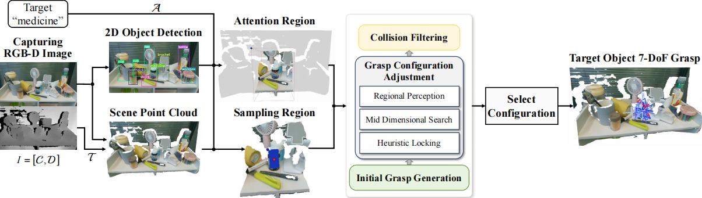
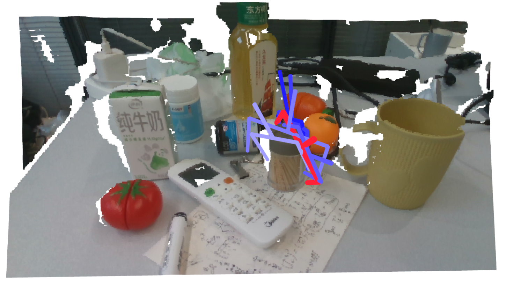
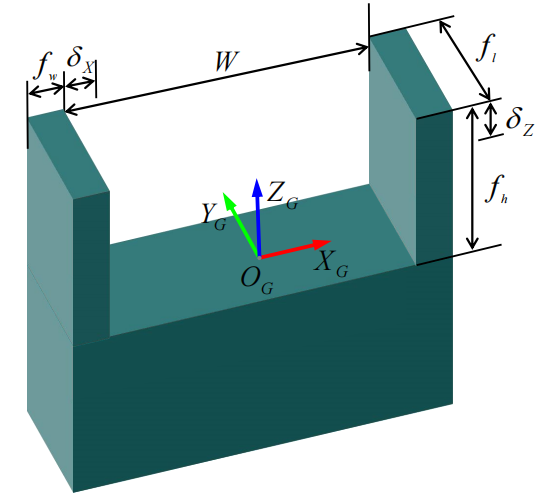

# Efficient 7-DoF Grasp for Target-driven Object in Dense Cluttered Scenes


This work proposes an algorithm that can generate 7-DoF grasps for any desired object directly from single-view point cloud data in cluttered scenes, without relying on data or models. [paper](None), [video](https://page.om.qq.com/page/O2JGd1HZM3OScZaw1bSQT9aQ0)

<p align="center">
  
</p>


## Installation

- Setup conda environment

```bash
# create conda environment
conda create -n gcg python=3.8

# activate conda environment
conda activate gcg

# install dependencies
pip install -r requirements.txt
```


## Run

### Offline Testing: 

Run the RGB-D images and scene point cloud data provided by './data/points_bag'. The offline region of interest, which is the 2D bounding box for the target object to be grasped, is triggered by mouse events. After the scene image pops up, click to select the box, and press Esc to exit the visualization. The camera intrinsic parameters have been written into the program; be sure to modify them if switching devices for input data collection.


```shell
python scripts/7dgcg_offline.py 
```

<p align="center">
  
</p>


### Online Execution: 

Make sure your computer has ROS1 and the relevant camera drivers installed. When the ROS parameter `start_gcg` is set to True, the scene point cloud data and the localization data of the detected target object for grasping are received via ROS topics. The processed grasp configuration is also sent through ROS topics.


```shell
python scripts/7dgcg_online.py 
```


## Grasper Model
Set up the mathematical model for the gripper, after which the candidate gripper pose calculations for both offline and online nodes will be generated based on this model. You can directly modify the corresponding parameters in the file ./cfg/robotiq_85/params.yaml according to the actual size of your gripper.


```bash
    "min_width": Minimum closing width of the gripper
    "max_width": Maximum opening width of gripper

    "finger_width": fw
    "finger_height": fh
    "finger_depth": fl
    
    "hand_width": Maximum external width of gripper, "max_width" + 2 * "finger_width"
    "hand_height": The bottom height of the gripper in the picture can be appropriately expanded
    "hand_depth": Depth of the bottom of the gripper in the picture
```

Most of the modifiable parameters mentioned in the article can be found in "./cfg/7Dgram.yaml".

<p align="center">
    
</p>


## Notes
- During the actual execution process, please ensure that you obtain an accurate hand-eye transformation matrix, as it has a significant impact on the execution results.

- The algorithm in this work is independent of the model of the robotic arm, thus only considering the collision situation between the gripper and the environment. During the actual execution process, we send the top three scoring grasp configurations to the robotic arm control program via ROS topics. The final executed grasp configuration is determined by the reachability of the robotic arm, which also includes collision detection between the robotic arm with the gripper during motion and at the endpoint with the environment.

- The semantic recognition, target matching, and control execution components of the actual grasping implementation process shown in the video are currently not publicly available. You can build these based on your actual equipment and requirements.


